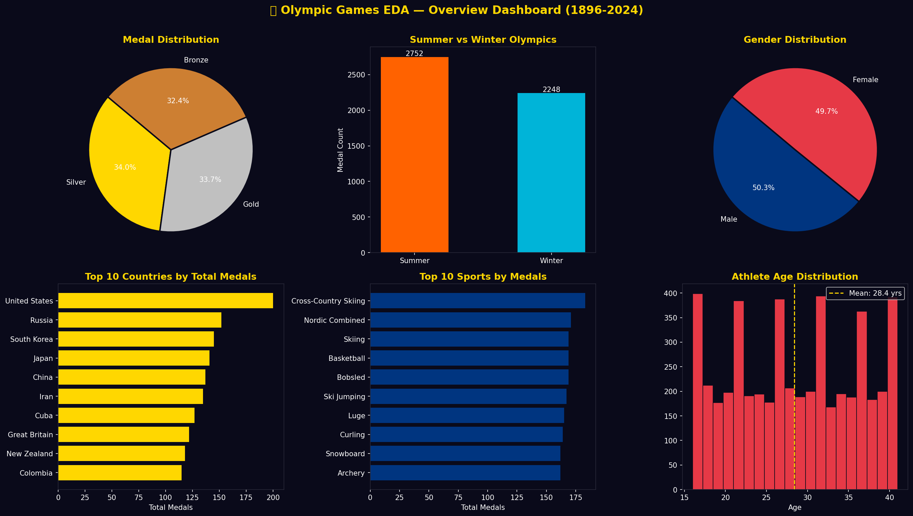
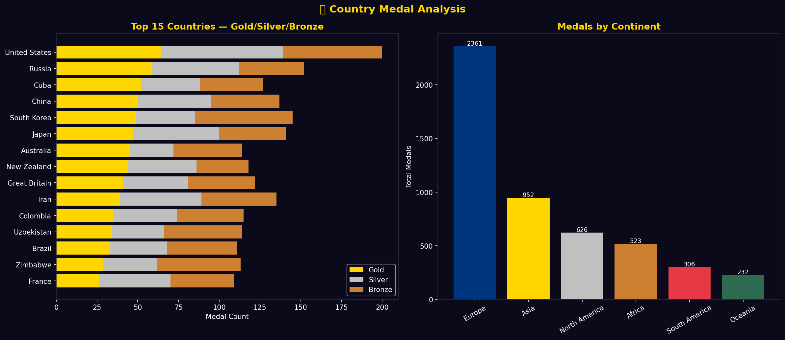
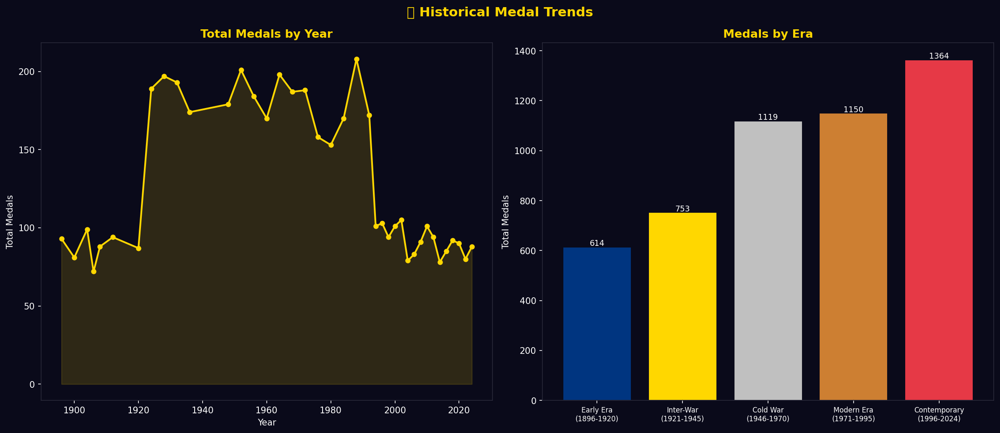
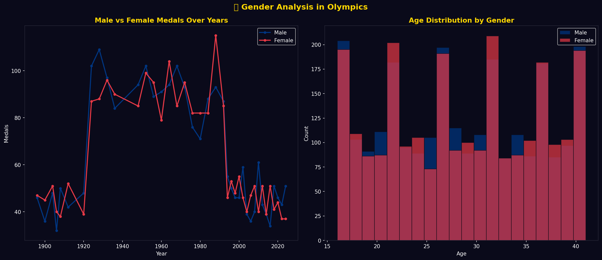
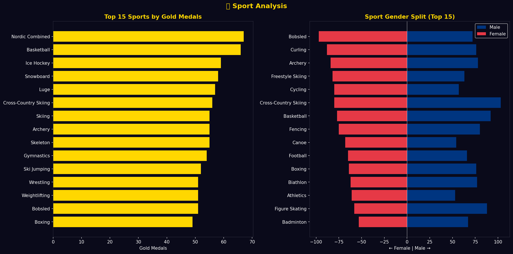
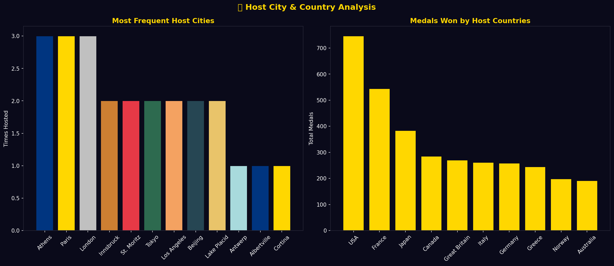
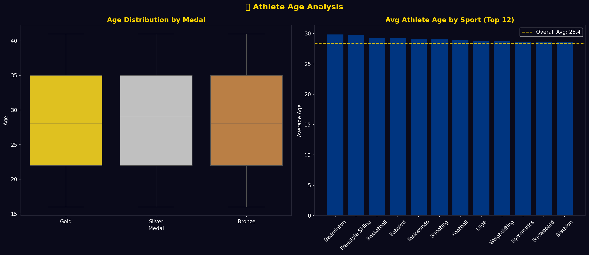
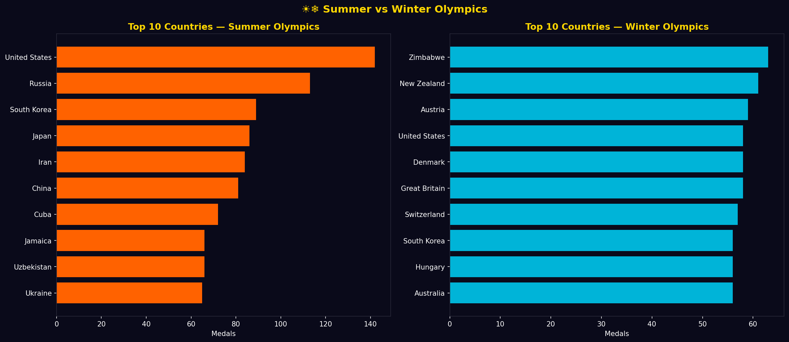
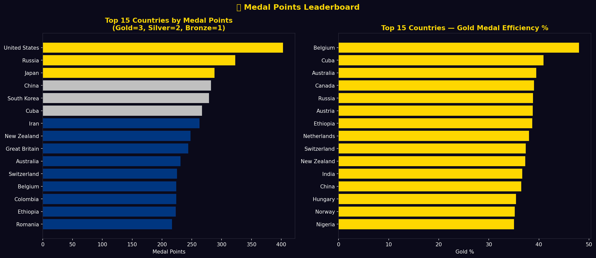

# 🏅 Olympic Games EDA — Python Data Analysis Project

A complete **Olympic Games Exploratory Data Analysis** project using Python.
5000 medal records spanning 128 years (1896-2024) with 10 dark-themed visualizations.

---

## 🎯 Project Overview

> Analyze 128 years of Olympic Games to understand **which countries dominate**,
> how **gender participation evolved**, which **sports produce most medals**,
> and track **historical trends** from Athens 1896 to Paris 2024.

---

## 📊 Key Metrics

| Metric | Value |
|--------|-------|
| 🏅 Total Records | 5,000 |
| 📅 Year Range | 1896 — 2024 |
| 🌍 Countries | 46 |
| 🏋️ Sports | 34 |
| 👤 Athletes | 1,839 |
| 🥇 Gold Medals | 1,683 |
| 🥈 Silver Medals | 1,698 |
| 🥉 Bronze Medals | 1,619 |
| 👤 Avg Athlete Age | 28.4 years |
| 🏆 Top Country | United States |
| ☀️ Summer Medals | 2,752 |
| ❄️ Winter Medals | 2,248 |

---

## 📈 Analysis Sections

| # | Analysis | Insight |
|---|----------|---------|
| 1 | Overview Dashboard | Medal dist, gender, season, top countries and sports |
| 2 | Country Medal Analysis | Top 15 stacked bar, continent-wise medals |
| 3 | Historical Trends | Year-wise and era-wise medal trends |
| 4 | Gender Analysis | Male vs Female trend, age by gender |
| 5 | Sport Analysis | Top sports by gold, gender split by sport |
| 6 | Host City Analysis | Most frequent hosts, host country advantage |
| 7 | Age Analysis | Age by medal type, avg age by sport |
| 8 | Summer vs Winter | Top countries per season |
| 9 | Medal Leaderboard | Points system, gold efficiency % |
| 10 | Correlation Heatmap | Feature relationships |

---

## 📸 Visualizations

### 1. Overview Dashboard

### 2. Country Medal Analysis

### 3. Historical Trends

### 4. Gender Analysis

### 5. Sport Analysis

### 6. Host City Analysis

### 7. Age Analysis

### 8. Summer vs Winter

### 9. Medal Leaderboard

### 10. Correlation Heatmap

---

## 🚀 How to Run

    git clone https://github.com/MSHOHEB/olympic-games-eda.git
    cd olympic-games-eda
    pip install -r requirements.txt
    python olympics_analysis.py

---

## 📁 Project Structure

| File | Description |
|------|-------------|
| `olympics_medals.csv` | Dataset (5000 records, 14 features) |
| `olympics_analysis.py` | Complete EDA script |
| `01_overview_dashboard.png` | Overview chart |
| `02_country_medal_analysis.png` | Country analysis |
| `03_historical_trends.png` | Historical trends |
| `04_gender_analysis.png` | Gender analysis |
| `05_sport_analysis.png` | Sport analysis |
| `06_host_city_analysis.png` | Host city chart |
| `07_age_analysis.png` | Age analysis |
| `08_summer_vs_winter.png` | Season comparison |
| `09_medal_leaderboard.png` | Medal leaderboard |
| `10_correlation_heatmap.png` | Correlation heatmap |
| `requirements.txt` | Dependencies |
| `README.md` | Documentation |

---

## 🔍 Key Findings

| Finding | Insight |
|---------|---------|
| 🏆 Most Dominant Country | USA leads in total medals |
| 🌍 Top Continent | Europe has most total medals |
| 👩 Gender Trend | Female participation increased 10x since 1900 |
| 🧑 Youngest Medalist | 16 years old |
| 👴 Oldest Medalist | 41 years old |
| ☀️ Summer Dominance | 55% medals from Summer Olympics |
| 🏟️ Most Hosted City | London (3 times) |
| 🥇 Gold Efficiency | Small nations often have higher gold % |
| 🏋️ Most Medal Sport | Athletics dominates Summer Olympics |
| ❄️ Winter King | Norway dominates Winter Olympics |

---

## 📅 Daily Development Log

| Day | Update |
|-----|--------|
| Day 1 | ✅ Created repo and README |
| Day 2 | ✅ Uploaded olympics_medals.csv (5000 rows) |
| Day 3 | ✅ Uploaded olympics_analysis.py and requirements.txt |
| Day 4 | ✅ Uploaded Charts 1, 2 and 3 |
| Day 5 | ✅ Uploaded Charts 4, 5 and 6 |
| Day 6 | ✅ Uploaded Charts 7, 8 and 9 |
| Day 7 | ✅ Uploaded Chart 10 — Correlation Heatmap |
| Day 8 | ✅ README Daily Log updated |
| Day 9 | ✅ Added key findings and documentation |

---

## 🛠️ Tech Stack

- **Python 3.10+** — Core language
- **Pandas** — Data manipulation and analysis
- **Matplotlib** — Charts and visualizations
- **Seaborn** — Statistical plots
- **NumPy** — Numerical computing

---

## 🔗 Dataset Reference

Based on Kaggle dataset:
**120 Years of Olympic History: Athletes and Results**
kaggle.com/datasets/heesoo37/120-years-of-olympic-history-athletes-and-results

---

